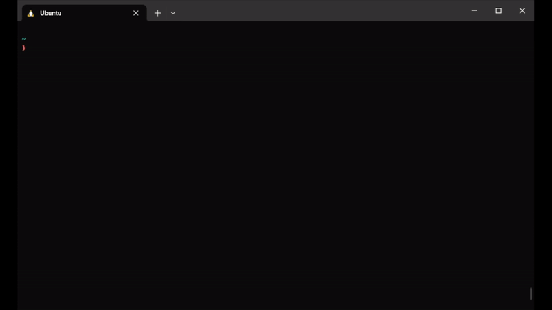
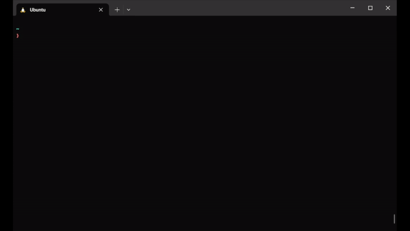

<h1 align="center"> ⛅ Weatherish


[](https://eslint.org/)
[](https://raw.githubusercontent.com/daspeon/teste/main/LICENSE)

</h1>

## Table of Contents

- [About](#about)
- [Requirements](#requirements)
- [Installing](#installing)
  - [Configuring](#configuring)
- [Usage](#usage)

## About

This is a personal project made to learn a little bit about Command Line Interfaces. It's a simple CLI that fetches weather data from a specific city, provided by the user, returning current local time and temperature, feels like, humidity and wind speed.

## Requirements:

- [NodeJS](https://nodejs.org/en) v.20 or higher

If you use [NVM](https://github.com/nvm-sh/nvm), just run `nvm use` inside of the root folder.

## Installing:

### Configuring

After cloning this repository, run the following command inside the root folder to install the project globally and allow you to use the commands at any directory you are, even if it's not the project's folder.

```bash
$ npm install -g .
```

Now you're good to go.

## Usage

This project accepts two units of measurement: metric and imperial. This option is not required, but, if you don't pass it, the default unit is going to be `metric` and local datetime format will be `DD/MM - HH:mm`. If you pass `imperial` as an option, all weather data will be displayed in `Fahrenheit` and local datetime format will be `MM/DD HH:mm AM/PM`.

```text
Usage: weather [options]

A CLI to check the weather from a city.

Options:
  -V, --version              Output the version number
  -c, --city <value>         Enter the city name
  -u, --units <value>        Choose units of measurement
  -h, --help                 Display help for command

Examples:
  weather -c "Curitiba"
  weather -c "London" -u imperial
```

**_Examples_**:

Default:



Passing unit as an option:



[⬆ Back to the top](#--weatherish)
