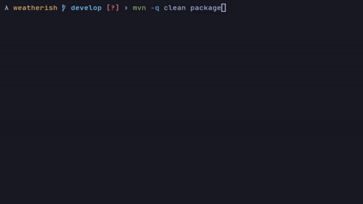

<h1 align="center"> Weatherish


[](https://github.com/laporeon/weatherish/blob/main/LICENSE.md)


</h1>

## Table of Contents

- [About](#about)
- [Requirements](#requirements)
- [Getting Started](#getting-started)
  - [Configuring](#configuring)
    - [.env](#env)
- [Usage](#usage)
- [Preview](#preview)

## About

Weatherish is a Java-based CLI that fetches real-time weather data for any city using the OpenWeatherMap API. It 
displays current temperature, feels like, humidity, wind speed and local time, all from your terminal.

## Requirements

- Java 21+
- Maven

## Getting Started

### Configuring

#### **.env**

For this step, you'll need to generate your api key at [OpenWeatherMap](https://openweathermap.org/api) website.

Rename the `.env.example` file to `.env` and update the variable with your generated key.

| key     | description              | default |
| ------- | ------------------------ | ------- |
| API_KEY | OpenWeatherMap's api key | -       |

## Usage
Inside the **root** folder, compile and run the application using the following commands:

1. Compile application:

```bash
mvn compile
```

2. Run application:

```bash
mvn exec:java
```

Then follow on-screen instructions.


## Preview



[⬆ Back to the top](#-weatherish)
