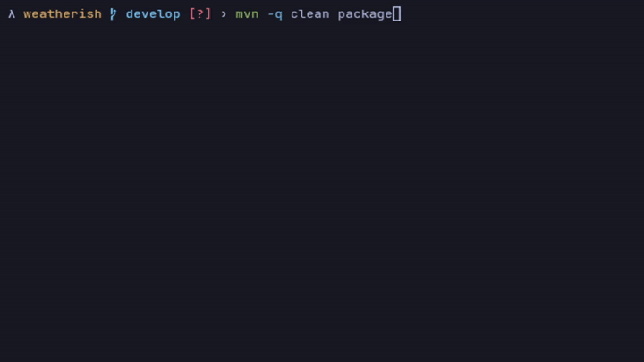

<h1 align="center"> Weatherish


[](https://github.com/laporeon/weatherish/blob/main/LICENSE.md)


</h1>

## Table of Contents

- [About](#about)
- [Requirements](#requirements)
- [Getting Started](#getting-started)
- [Usage](#usage)

## About

Weatherish is a Java-based CLI that fetches current weather data for any city using the OpenWeatherMap API. It 
displays current temperature, feels like, humidity, wind speed and local time, all from your terminal.

## Requirements

- Java 21+
- Maven 3.9+

## Getting Started

**1. Set up your API key**

You'll need an API key from [OpenWeatherMap](https://openweathermap.org/api). Once inside the project directory, set the `API_KEY` variable:

Linux / macOS — for the current session only:

```bash
export API_KEY=your-api-key
```

To persist, add to your `.bashrc` or `.zshrc` and reload:

```bash
export API_KEY=your-api-key
source ~/.bashrc  # or source ~/.zshrc
```

Windows — Command Prompt:

```cmd
set API_KEY=your-api-key
```

Windows — PowerShell:

```powershell
$env:API_KEY = "your-api-key"
```

> [!NOTE]
> `set` and `$env:` are session-only on Windows. To persist, add via System Properties → Environment Variables.

**2. Build**

```bash
mvn clean package
```

This will create an executable JAR at `target/weatherish.jar`.

**3. Run**

Pick the option that fits your workflow:

**Option 1 — Direct JAR execution**

```bash
# Linux / macOS
java -jar target/weatherish.jar
 
# Windows
java -jar target\weatherish.jar
```

**Option 2 — Wrapper script**

```bash
# Linux / macOS (first time only: make it executable)
chmod +x weatherish
./weatherish
 
# Windows
weatherish.bat
```

**Option 3 — System-wide alias (run `weatherish` from anywhere)**

Linux / macOS — add to your `.bashrc` or `.zshrc`:

```bash
alias weatherish='java -jar /full/path/to/weatherish/target/weatherish.jar'
```

Then reload your profile:

```bash
source ~/.bashrc  # or source ~/.zshrc
```

Windows — add to your PowerShell profile (`$PROFILE`):

```powershell
function weatherish { java -jar "C:\full\path\to\weatherish\target\weatherish.jar" }
```

Then reload:

```powershell
. $PROFILE
```

## Usage

Run the application using your preferred option and enter the desired city when prompted. The CLI will display current weather information for that location.



[⬆ Back to the top](#-weatherish)
